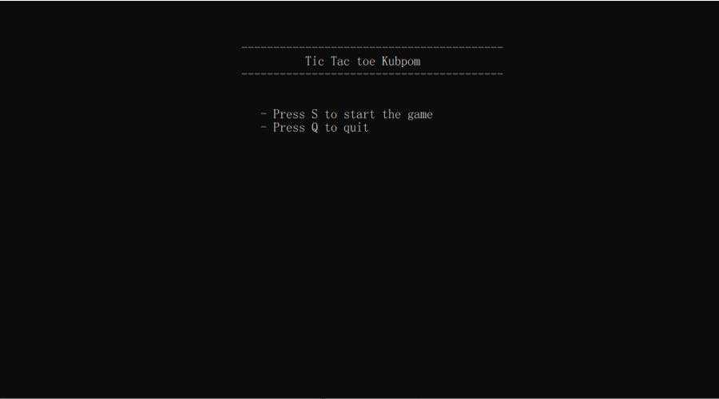

# Project ComPro Tic-Tac-Toe



## 📝Description

เกม Tic-Tac-Toe ที่สร้างขึ้นโดยใช้ภาษา C ง่ายๆ ไม่ใช้โค้ดซับซ้อน ไม่ต้องการสเป๊คเครื่องสูง เล่นได้ทุกเพศทุกวัย เล่นได้ทุกที่ ขอเเค่มีตัวรันภาษา C

## 🔢Code Details

```
#include <stdio.h>
#include <stdlib.h>
#include <ctype.h>
#include <time.h>
#include <conio.h>
#include <string.h>
#include <stdbool.h>

char board[3][3];
const char PLAYER = 'X';
const char AI = 'O';

void resetBoard();
void printBoard();
int checkFreeSpace();
void playerMove();
void AiMove();
char checkWinner();
void printWinner(char);
void game();
int main()
{
   while(true){
      system("cls");
      char let;
      printf("\n\n\n\t\t\t\t\t -----------------------------------------");
      printf("\n\t\t\t\t\t\t   Tic Tac toe Kubpom");
      printf("\n\t\t\t\t\t -----------------------------------------\n\n");
      printf("\n\t\t\t\t\t    - Press S\033[0;37m to start the game");
      printf("\n\t\t\t\t\t    - Press Q\033[0;37m to quit             ");

      let = toupper(getch());
      if(let=='S'){
         system("cls");
         game();
         break;
      }
      else if (let=='Q'){
         system("cls");
         exit(1);
         break;
      }
      else
         printf("\n\n\n\n\t\t\t\t\t      Press enter Q or S   Isasss          ");
         getch();
   }
}

void game()
{
   char winner = ' ';

   resetBoard();

      while(winner == ' ' && checkFreeSpace() != 0)
      {
         printBoard();

         playerMove();
         winner = checkWinner();
         if(winner != ' ' || checkFreeSpace() == 0)
         {
            break;
         }

         AiMove();
         winner = checkWinner();
         if(winner != ' ' || checkFreeSpace() == 0)
         {
            break;
         }
      }

      printBoard();
      printWinner(winner);

   printf("\nThanks for playing!");
}

void resetBoard()
{
   for(int i = 0; i < 3; i++)
   {
      for(int j = 0; j < 3; j++)
      {
         board[i][j] = ' ';
      }
   }
}
void printBoard()
{
   printf("\033[1;31m  %c | %c | %c ", board[0][0], board[0][1], board[0][2]);
   printf("\n\033[1;31m ---|---|---\n");
   printf("\033[1;31m  %c | %c | %c ", board[1][0], board[1][1], board[1][2]);
   printf("\n\033[1;31m ---|---|---\n");
   printf("\033[1;31m  %c | %c | %c ", board[2][0], board[2][1], board[2][2]);
   printf("\n");
}
int checkFreeSpace()
{
   int freeSpaces = 9;

   for(int i = 0; i < 3; i++)
   {
      for(int j = 0; j < 3; j++)
      {
         if(board[i][j] != ' ')
         {
            freeSpaces--;
         }
      }
   }
   return freeSpaces;
}
void playerMove()
{
   int x;
   int y;

   do
   {
      printf("\033[0;32mEnter row #(1-3): \033[0;32m");
      scanf("%d", &x);
      x--;
      printf("Enter column #(1-3): ");
      scanf("%d", &y);
      y--;

      if(board[x][y] != ' ')
      {
         printf("Invalid move!\n");
      }
      else
      {
         board[x][y] = PLAYER;
         break;
      }
   } while (board[x][y] != ' ');
   
}
void AiMove()
{
   srand(time(0));
   int x;
   int y;

   if(checkFreeSpace() > 0)
   {
      do
      {
         x = rand() % 3;
         y = rand() % 3;
      } while (board[x][y] != ' ');
      
      board[x][y] = AI;
   }
   else
   {
      printWinner(' ');
   }
}
char checkWinner()
{
   //check rows
   for(int i = 0; i < 3; i++)
   {
      if(board[i][0] == board[i][1] && board[i][0] == board[i][2])
      {
         return board[i][0];
      }
   }
   //check columns
   for(int i = 0; i < 3; i++)
   {
      if(board[0][i] == board[1][i] && board[0][i] == board[2][i])
      {
         return board[0][i];
      }
   }
   //check diagonals
   if(board[0][0] == board[1][1] && board[0][0] == board[2][2])
   {
      return board[0][0];
   }
   if(board[0][2] == board[1][1] && board[0][2] == board[2][0])
   {
      return board[0][2];
   }

   return ' ';
}
void printWinner(char winner)
{
   if(winner == PLAYER)
   {
      printf("YOU WIN!");
   }
   else if(winner == AI)
   {
      printf("YOU LOSE!");
   }
   else{
      printf("IT'S A TIE!");
   }
}
```

## ▶️Presentation Clip

https://youtu.be/Sfj91y5pSL4

## ⭐Getting Started

### 🖥️Dependencies

* ระบบปฎิบัติการที่สามารถรันภาษา C ได้
* ยกตัวอย่างเช่น Window 10

### 📁Installing

* ดาวน์โหลดไฟล์ zip จาก github
* เเตกไฟล์ลงบนโฟลเดอร์ที่ต้องการ

### 👨‍💻Executing program

* กดรันตัว tic_tac_toe.exe

## 👨Author

ex. Alongkorn-64070253

## 👪Project Members

[](https://github.com/Alongkorn-64070253) | [](https://github.com/it64070150) | [](https://github.com/Chayanut45) | [](https://github.com/Weerapong-Pannisai-64070104)
---|---|--- | ---
[นายอลงกรณ์ จุฑาทัศน์ 64070253](https://github.com/Alongkorn-64070253) |[นายตรัยธรรม แสงเดือน 64070150](https://github.com/it64070150) |[นายชยณัฐ ศุทธยาลัย 64070136](https://github.com/Chayanut45) |[นายวีรพงศ์ ปานนิสัย 64070104](https://github.com/Weerapong-Pannisai-64070104)
